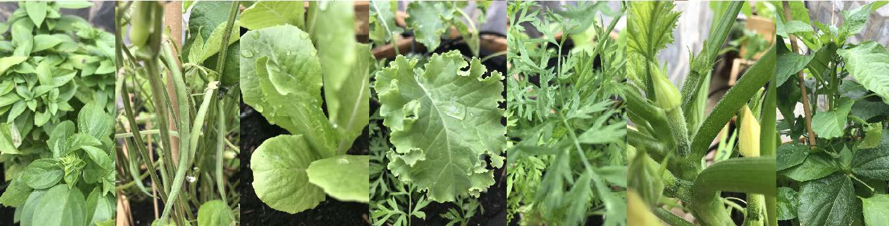

    </img>

___

# Semenzaio smart

    </img>

**Autori**: Alberto Rizzi, Lorenzo Marcolli

**Link a repo**: https://github.com/albertorizzi/semenzaio-smart

**Licenza scelta**: GNU GENERAL PUBLIC LICENSE version 3 (GPLv3)

**Data *indicativa* di presentazione**: dicembre 2023

## Descrizione
Il progetto prevede la realizzazione di un semenzaio smart mediante l'utilizzo della scheda Arduino® UNO R4 WiFi. Questo dispositivo è in grado di favorire la crescita controllata delle piante di ortaggi, le quali saranno successivamente trapiantate in terra.

All'interno di una mini serra sono stati installati diversi sensori dedicati al monitoraggio di parametri cruciali per lo sviluppo delle piantine, tra cui luminosità, umidità del terreno e temperatura.

Considerando che diverse specie vegetali richiedono condizioni ottimali specifiche per la crescita, i relativi valori sono memorizzati e configurati in un database (Firebase). Questi parametri possono essere regolati attraverso un'App Mobile sviluppata con React Native.

Arduino, durante la fase di setup, acquisirà la configurazione dei valori per la coltura selezionata: mediante i sensori, monitorerà i parametri ambientali e attiverà/spegnerà gli attuatori in base al superamento o no dei valori rispetto alla soglia preimpostata.

Gli attuatori utilizzati sono i seguenti:
- riscaldatore per regolare la temperatura
- pompa per nebulizzare l'acqua per regoare l'umidità del terreno
- lampada per garantire la luminosità necessaria

## Lista materiali
**Componenti hardware**:
- Arduino® UNO R4 WiFi
- Sensore di temperatura e umidità (DHT11)
- Sensore di luminosità (fotoresistenza)
- Modulo relè 4 canali
- Sensore umidità terreno YL-69 e HC-38
- Riscaldatore (resistenza da 80 W, 220 V)
- 2 lampade per fitocoltivazione da 10 W
- Pompa 220 V per nebulizzare acqua
- Ventola da raffreddamento per muovere aria

## Librerie
- `"WiFiSSLClient.h"`
- `"WiFiS3.h"`
- `<ArduinoJson.h>`
- `"DHT.h"`
- `"Arduino_LED_Matrix.h"`

## Circuito

    </img>

🔗 [Fritzing file](assets/Semenzaio%20Smart.fzz)

## App
L'app mobile consente di visualizzare i dati in tempo reale, aggiornati ogni 5 secondi, prelevando i valori dalla collezione "logs" di Firebase in tempo reale. Inoltre, offre la possibilità di modificare la coltura e le relative impostazioni, poiché Arduino funge anche da WebServer. Attraverso chiamate HTTP, è possibile controllare l'accensione/spegnimento della ventola e gestire il cambio della coltura.

*Importante*: per ottenere un funzionamento ottimale, è fondamentale che Arduino e il dispositivo mobile siano connessi alla stessa rete Wi-Fi.

    </img>
    </img>
    </img>
    </img>

## Media
### Semina della coltura

Semina della coltura di pomodori, posizionamento del sensore di umidità del terreno.

### Cambio coltura
Cambio della coltura attuale tramite la pagina di configurazione dell'app. La nuova coltura necessitando di parametri di luce diversi fa scaturire l'accensione della luce. 

### Sensore luminosità
Cambiando la luminosità ambientale, il valore di luminosità scende sotto la soglia minimna, pertanto si accende la luce.

### Accesione pompa
Cambiando i parametri necessari di umidità del suono, viene suparata la soglia minima della coltura attuale, pertanto si accende la pompa per nebulizzare l'acqua.

### Accensione ventola
Cambiando il valore ON/OFF sulla App Mobile, si accende e spegne la ventola.

### Fasi della crescita della coltura del pomodoro
Fotogrammi relativi alla crescita della coltura del pomodoto in ambiente controllato, 7 giorni.

